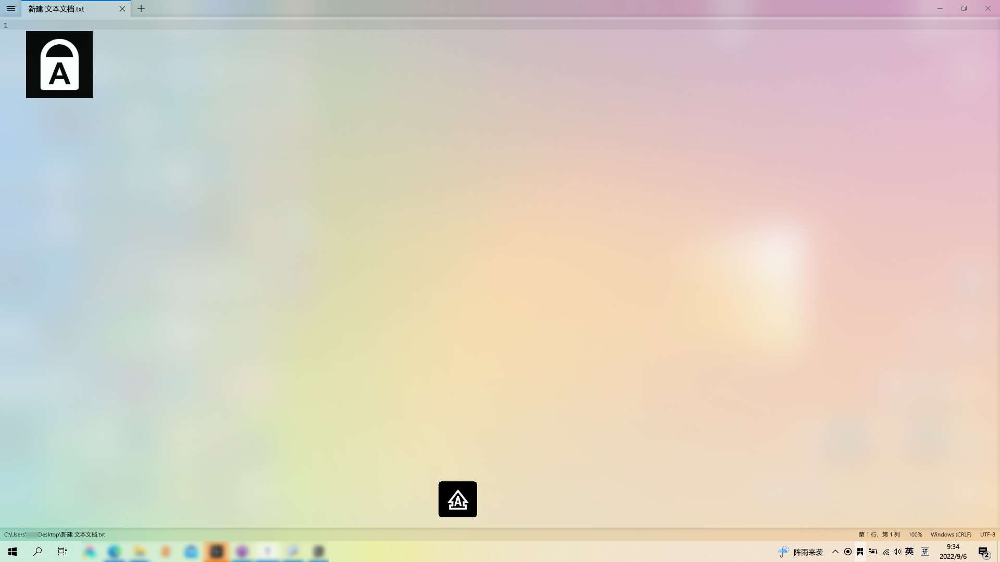

# Toggle Keys Notification

### Description

A python script that shows a notification when **Caps Lock** or **Num Lock** keys are pressed. It is useful for people that don't have **LEDs** on their keyboards. 

### Top-left notification

use `top-left_notify.py` if you want to have a try.

By [rgzz666](http://rgzz.great-site.net/)

When you press <kbd>CapsLock</kbd> or <kbd>NumLock</kbd>, you'll see a small notification window on the top-left corner.

(the bottom-middle one is from my laptop)

### Currently available:

- **Windows** 

  

 

- **Linux**

  

 

### Do you want to contribute?

Click on [this](CONTRIBUTING.md) and follow the proper steps to become a contributor.

Make sure you follow the [code of conduct](CODE_OF_CONDUCT.md).

